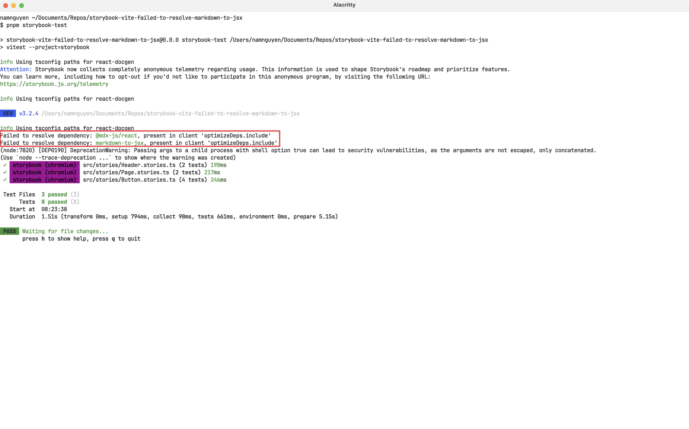

# Vite failed to resolve `markdown-to-jsx` dependency after `@storybook/addon-docs` is added

Steps to reproduce [the issue](https://github.com/storybookjs/storybook/issues/32570):

1. Run `pnpm install`.
3. Ensure there is no Storybook cache by running `rm -rf node_modules/.cache/storybook`.
3. Run `pnpm storybook-test`
3. Observe the command logs.

